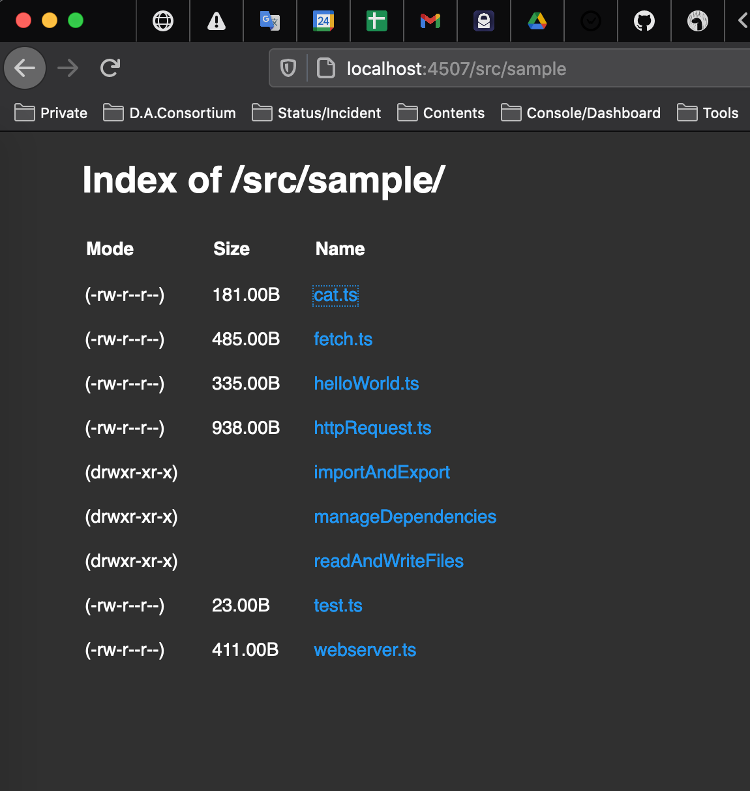

## Install once only.

```
> deno install --allow-net --allow-read https://deno.land/std@0.81.0/http/file_server.ts
Download https://deno.land/std@0.81.0/http/file_server.ts
...
Check https://deno.land/std@0.81.0/http/file_server.ts
✅ Successfully installed file_server
/Users/ko-kamenashi/.deno/bin/file_server
ℹ️  Add /Users/ko-kamenashi/.deno/bin to PATH
    export PATH="/Users/ko-kamenashi/.deno/bin:$PATH"
> export PATH="/Users/ko-kamenashi/.deno/bin:$PATH"
```
## Try execute the command.

```
> file_server .
HTTP server listening on http://0.0.0.0:4507/
[2020-12-24 11:31:05] "GET / HTTP/1.1" 200
No such file or directory (os error 2)
[2020-12-24 11:31:05] "GET /favicon.ico HTTP/1.1" 404
[2020-12-24 11:31:05] "GET / HTTP/1.1" 200
[2020-12-24 11:31:21] "GET /src HTTP/1.1" 200
[2020-12-24 11:31:21] "GET /src HTTP/1.1" 200
[2020-12-24 11:31:25] "GET /src/sample HTTP/1.1" 200
[2020-12-24 11:31:26] "GET /src/sample HTTP/1.1" 200
[2020-12-24 11:31:32] "GET /src/sample/cat.ts HTTP/1.1" 200
```

